# 🎬 Movie Watchlist

A full-stack web application for managing your personal movie watchlist. Built with React.js frontend and Node.js + Express backend, powered by TMDB API.

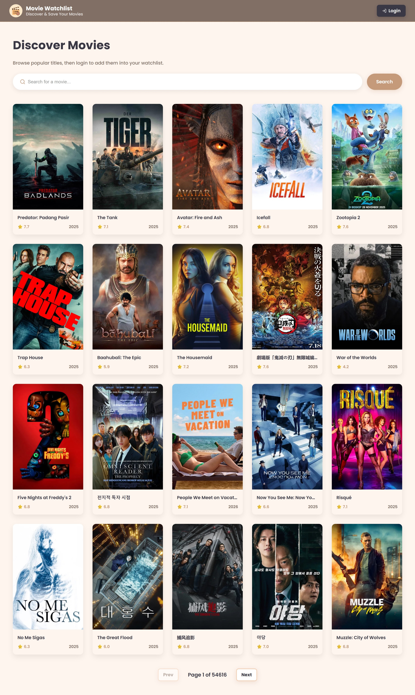

---

## ✨ Features

### 👤 User Features
- **Browse Movies** - Explore popular movies from TMDB
- **Search Movies** - Find movies by keyword
- **Watchlist Management** - Add, remove, and organize your movies
- **Watch Status** - Mark movies as "Watched" or "To Watch"
- **Movie Details** - View poster, rating, release date, and synopsis
- **Profile Management** - Update profile photo

### 👨‍💼 Admin Features
- **Dashboard** - View statistics (total users, movies, watched count)
- **User Management** - View, search, filter, and delete users
- **Popular Movies** - See most saved movies by users
- **Activity Logs** - Monitor user activities in real-time
- **Profile Management** - Update admin profile

### 🔐 Authentication
- Separate login for User and Admin
- JWT Token authentication
- Logout confirmation with token blacklisting

---

## 📸 Screenshots

### Public Pages

**Public Movies**


**Login User**
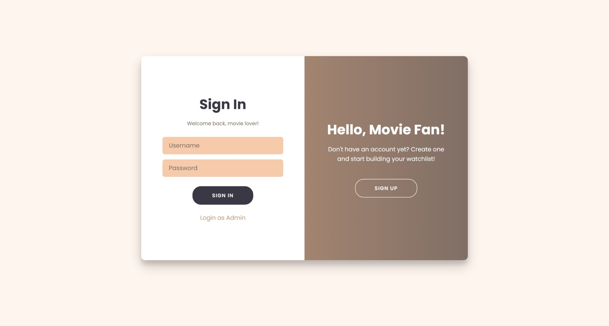

**Register**
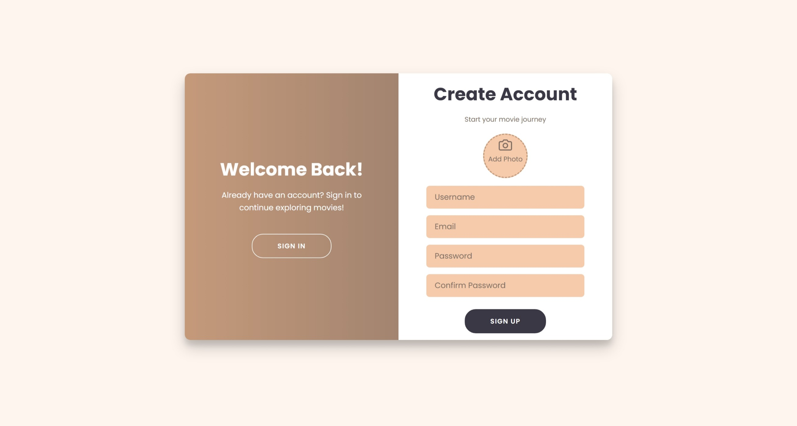

---

### User Pages

**Dashboard**
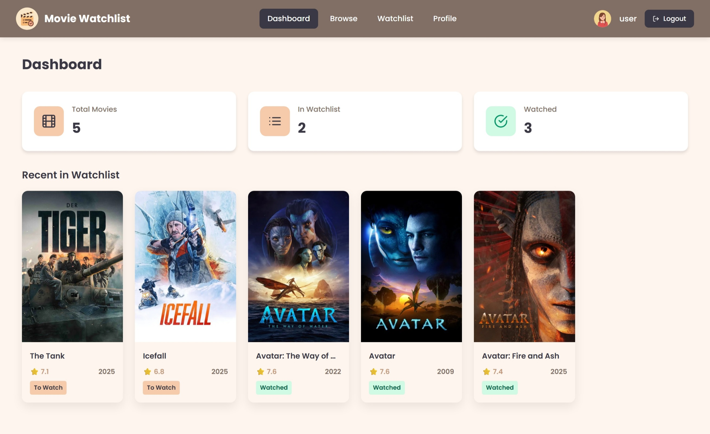

**Browse Movies**
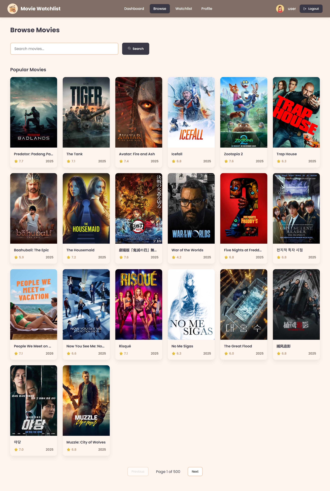

**Watchlist**
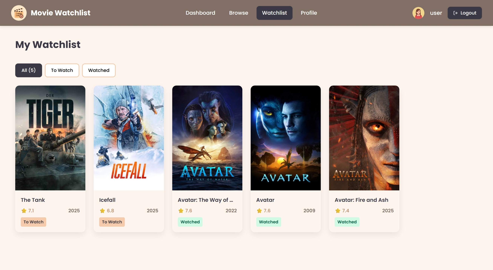

**Profile**
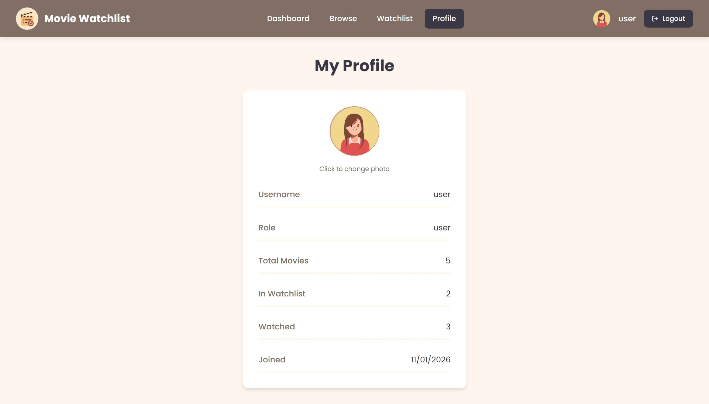

**Logout**
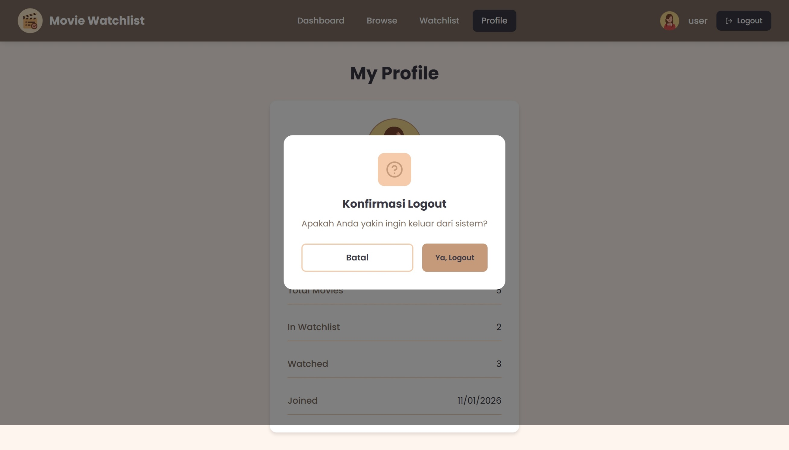

---

### Admin Pages

**Dashboard**
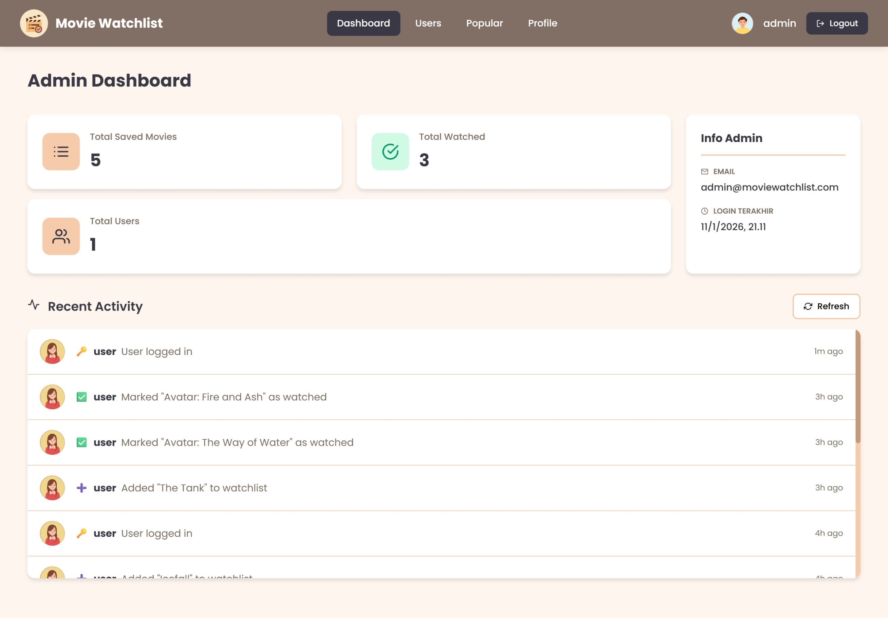

**User Management**
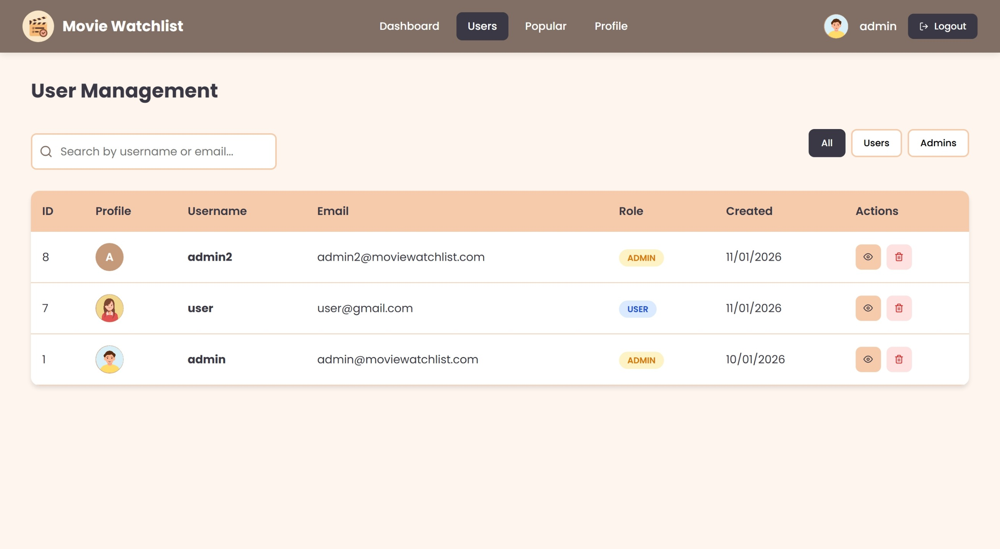

**Popular Movies**
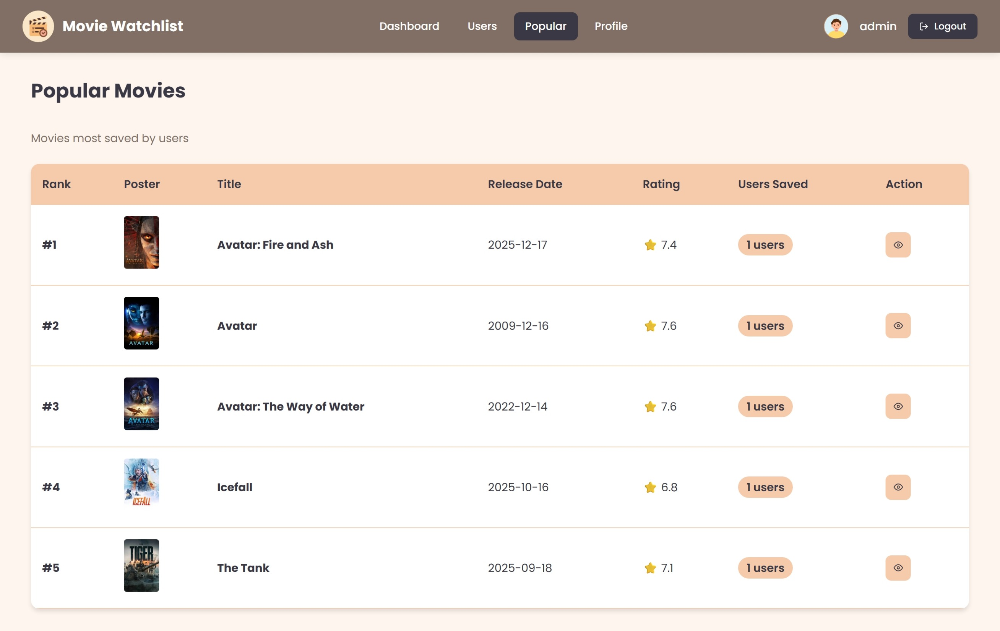

**Admin Profile**
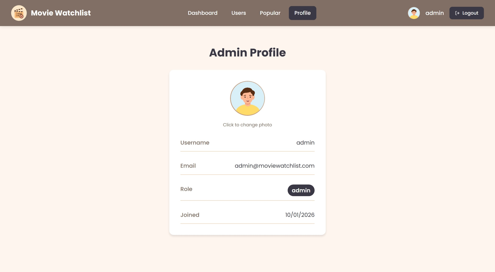

**Admin Login**
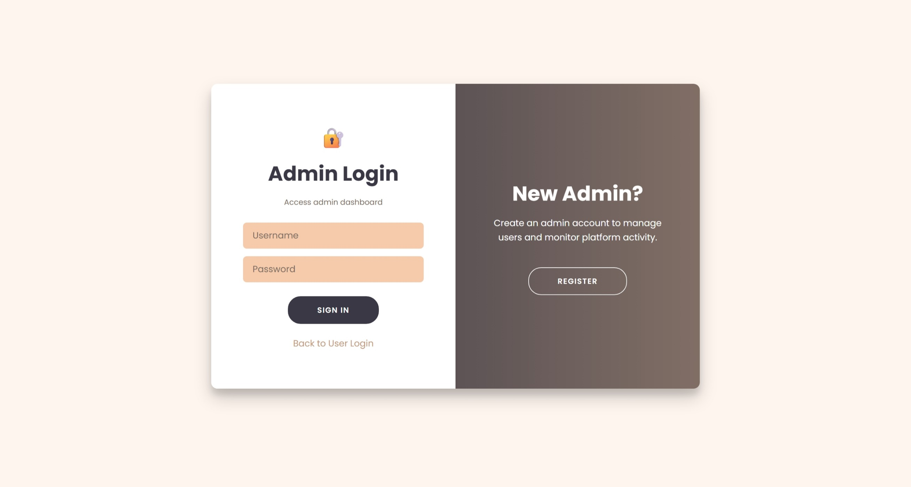

**Register**


**Logout**
 |

---

## 🛠️ Tech Stack

### Frontend
- **React.js** - UI Framework
- **React Router** - Navigation
- **Axios** - HTTP Client
- **React Icons** - Icon Library
- **CSS3** - Styling

### Backend
- **Node.js** - Runtime
- **Express.js** - Web Framework
- **Sequelize** - ORM
- **MySQL** - Database
- **JWT** - Authentication
- **Bcrypt** - Password Hashing

### External API
- **TMDB API** - The Movie Database API

---

## 🎬 TMDB API

This project uses [The Movie Database (TMDB) API](https://www.themoviedb.org/documentation/api) as the source for movie data.

**Base URL:** `https://api.themoviedb.org/3`

**Endpoints Used:**
| Endpoint | Description |
|----------|-------------|
| `GET /movie/popular` | Get popular movies |
| `GET /search/movie` | Search movies by keyword |

**Data Retrieved:**
- Movie ID, Title, Poster, Rating, Release Date, Overview

> 📝 Note: You need to register at [TMDB](https://www.themoviedb.org/) to get your own API key.

---

## 📋 API Endpoints

### Public Endpoints (No Auth)
| Method | Endpoint | Description |
|--------|----------|-------------|
| GET | `/api/public/movies/popular` | Get popular movies |
| GET | `/api/public/movies/search` | Search movies |

### Auth Endpoints
| Method | Endpoint | Description |
|--------|----------|-------------|
| POST | `/api/auth/register/user` | Register new user |
| POST | `/api/auth/register/admin` | Register new admin |
| POST | `/api/auth/login` | Login user/admin |
| POST | `/api/auth/logout` | Logout |

### User Endpoints (Auth: user)
| Method | Endpoint | Description |
|--------|----------|-------------|
| GET | `/api/user/dashboard` | Get dashboard stats |
| GET | `/api/user/movies/popular` | Get popular movies |
| GET | `/api/user/movies/search` | Search movies |
| GET | `/api/user/watchlist` | Get watchlist |
| POST | `/api/user/watchlist` | Add to watchlist |
| DELETE | `/api/user/watchlist/:id` | Remove from watchlist |
| PUT | `/api/user/watchlist/:id` | Update status |
| GET | `/api/user/profile` | Get profile |
| PUT | `/api/user/profile/photo` | Update photo |

### Admin Endpoints (Auth: admin)
| Method | Endpoint | Description |
|--------|----------|-------------|
| GET | `/api/admin/dashboard` | Get admin stats |
| GET | `/api/admin/activity-logs` | Get activity logs |
| GET | `/api/admin/users` | Get all users |
| DELETE | `/api/admin/users/:id` | Delete user |
| GET | `/api/admin/popular` | Get popular movies |
| GET | `/api/admin/profile` | Get admin profile |

---

## 🚀 Getting Started

### Prerequisites
- Node.js v18+
- MySQL
- TMDB API Key

### Installation

1. **Clone the repository**
```bash
git clone https://github.com/salmaarayyan/.082_ProjectAkhirPWS.git
cd .082_ProjectAkhirPWS
```

2. **Setup Backend**
```bash
cd backend
npm install
```

3. **Configure Environment**
Create `.env` file in backend folder:
```env
PORT=5000
DB_HOST=localhost
DB_USER=root
DB_PASSWORD=your_password
DB_NAME=movie_watchlist
JWT_SECRET=your_jwt_secret
TMDB_API_KEY=your_tmdb_api_key
```

4. **Run Migrations**
```bash
npx sequelize-cli db:migrate
```

5. **Start Backend**
```bash
npm run dev
```

6. **Setup Frontend**
```bash
cd ../frontend
npm install
npm start
```

7. **Open Browser**
```
http://localhost:3000
```

---

## 📁 Project Structure

```
movie-watchlist/
├── frontend/                 # React Frontend
│   ├── src/
│   │   ├── components/       # Reusable components
│   │   ├── pages/            # Page components
│   │   ├── services/         # API services
│   │   └── App.js            # Main app
│   └── package.json
│
├── backend/                  # Node.js Backend
│   ├── config/               # Database config
│   ├── controllers/          # Route controllers
│   ├── middleware/           # Auth middleware
│   ├── models/               # Sequelize models
│   ├── routes/               # API routes
│   ├── services/             # TMDB service
│   ├── utils/                # Utilities
│   ├── migrations/           # DB migrations
│   └── server.js             # Entry point
│
└── documentation/            # Project documentation
    ├── screenshots/          # App screenshots
    └── THREE-TIER-EXPLANATION.md
```

---

## 📄 License

This project is for educational purposes.

---

## 🙏 Acknowledgments

- [TMDB](https://www.themoviedb.org/) for movie data API
- [React Icons](https://react-icons.github.io/react-icons/) for icons
- [Google Fonts](https://fonts.google.com/) for Poppins font

